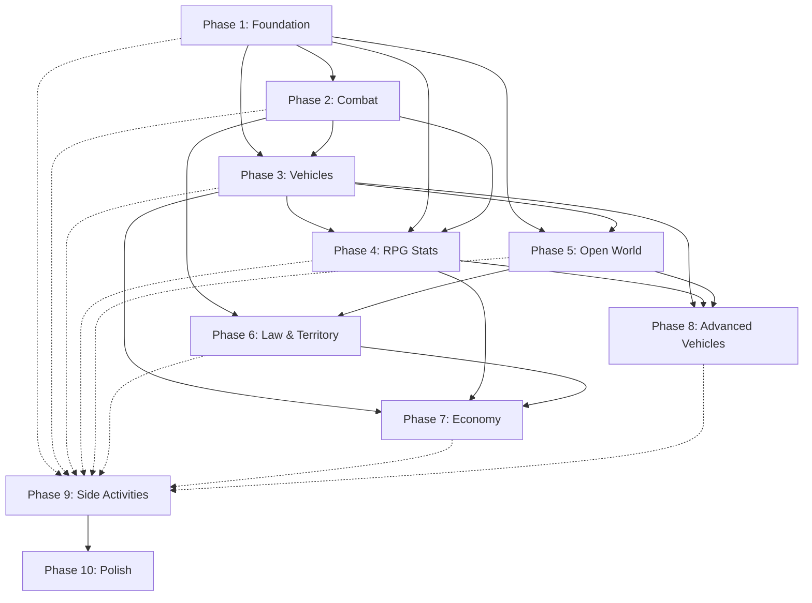

# GTA:SA — Execution Phases & Architecture

---

# Execution Phases

Each phase is an ordered implementation milestone. Features are defined in the Implementation Plan — phases reference them. Test checklists live here so you know what to verify after completing each phase.

---

## Phase 1 — Foundation & Core Player

<aside>
🎯

Retire variant prototypes. Build the single player character and movement.

</aside>

- [ ]  **Player Movement** (Section 1)

**Dependencies:** None — root of the graph.

### Test Checklist

- [ ]  Walk/Run/Sprint transitions feel correct at different analog stick magnitudes
- [ ]  Sprint drains stamina; stops sprinting when depleted
- [ ]  Crouch toggles on/off; movement is slower than walking
- [ ]  Jump preserves forward velocity; auto-climbs ledges on contact
- [ ]  Swim surface: breaststroke by default, front crawl when sprinting (drains stamina)
- [ ]  Swim dive: enter by pressing fire on surface; sprint for thrust; lung capacity drains; health drains when depleted
- [ ]  Climb: auto-latches to reachable ledges/fences when jumping toward them
- [ ]  Combat roll: only works while aiming + crouching with firearm equipped
- [ ]  Fall damage: no damage from small drops; quadratic scaling from moderate heights; lethal from extreme heights
- [ ]  Fall damage ignores armor completely
- [ ]  With 176 HP (max), survive any fall
- [ ]  Camera orbits smoothly; no clipping through walls; adjusts on collision
- [ ]  All movement states correctly replicated in the `eMoveState` enum
- [ ]  Stamina regenerates over time when not sprinting
- [ ]  Lung capacity regenerates when above water
- [ ]  Enhanced Input bindings work for all on-foot actions

---

## Phase 2 — Combat Systems

<aside>
⚔️

All on-foot combat: melee, firearms, targeting, stealth.

</aside>

- [ ]  **Hand-to-Hand Combat** (Section 2)
- [ ]  **Weapon Combat** (Section 3)
- [ ]  **Stealth** (Section 4)

**Dependencies:** Phase 1

### Test Checklist

**Hand-to-Hand:**

- [ ]  All 4 fighting styles have distinct combo chains (3-4 hits), running attack, and ground stomp
- [ ]  Only one style active at a time; learning new one replaces previous
- [ ]  Blocking (hold lock-on without attacking) reduces melee damage but doesn't eliminate it
- [ ]  Sustained combo breaks through block
- [ ]  Muscle stat visibly increases melee damage output

**Melee Weapons:**

- [ ]  Each of 10 melee weapons has correct damage and range from weapon.dat
- [ ]  Knife stealth kill: instant kill from behind while crouched + locked on
- [ ]  Katana can decapitate
- [ ]  Chainsaw deals continuous damage while held against target

**Firearms:**

- [ ]  All weapon slots (2-9) fire correctly with proper damage, clip size, and fire rate
- [ ]  Reload works; clip empties and refills from ammo pool
- [ ]  Desert Eagle damage doubles at Gangster tier (70 to 140)
- [ ]  Shotgun pellet spread works (multiple hit traces per shot)

**Lock-On:**

- [ ]  Auto-aim within 90 degree frontal cone; locks closest hostile
- [ ]  Reticle color: green, orange, red, black (dead)
- [ ]  Target cycling with input
- [ ]  Lock-on range increases per weapon skill tier
- [ ]  Rifles, snipers, heavy, and thrown weapons cannot lock on

**Weapon Skills:**

- [ ]  Skill points accumulate per hit on damageable target (correct rates per weapon)
- [ ]  Tier transitions are instant snaps (not gradual)
- [ ]  Each tier visibly changes: accuracy, move speed while aiming, lock-on range, animation group
- [ ]  Dual-wield activates at Hitman for Sawn-Off, Micro SMG, Tec-9, Pistol
- [ ]  Dual-wield doubles clip size and disables lock-on

**Headshots:**

- [ ]  Headshot = instant kill on NPCs with `SUFFERS_CRITICAL_HITS` = true
- [ ]  Mission-critical NPCs (flag = false) survive headshots
- [ ]  Player (CJ) does NOT receive instant-kill headshots
- [ ]  No body-part damage differentiation (all non-head hits = flat damage)

**Drive-By:**

- [ ]  Driver: SMGs only, fire left/right window, cannot aim forward/behind
- [ ]  Passenger: wider arc, can use pistols/SMGs/shotguns/ARs
- [ ]  Motorcycle: one-handed SMG, more flexible arc

**Stealth:**

- [ ]  Crouching makes minimap blip blue
- [ ]  Movement while crouched is silent; running/sprinting breaks stealth
- [ ]  Enemies detect player within ~120 degree frontal arc at ~15-20 unit range
- [ ]  Stealth kill doesn't alert enemies outside direct line of sight
- [ ]  Silenced 9mm is quieter but not perfectly silent (~5 unit detection)
- [ ]  Gunfire alerts all NPCs in radius regardless of facing

---

## Phase 3 — Vehicles

<aside>
🚗

Drivable cars, motorcycles, and bicycles.

</aside>

- [ ]  **Vehicles: Ground** (Section 5)

**Dependencies:** Phase 1, Phase 2 (for drive-by)

### Test Checklist

**Core Driving:**

- [ ]  Enter/exit vehicles with animation transition; controller possesses vehicle pawn
- [ ]  At least 3 representative cars feel distinct (sports car vs sedan vs truck) based on handling data
- [ ]  FWD/RWD/AWD drivetrain differences are noticeable (understeer vs oversteer)
- [ ]  Steering lock angle matches handling data per vehicle
- [ ]  Top speed matches `fMaxVelocity` per vehicle
- [ ]  Braking force feels proportional to `fBrakeDeceleration`

**Motorcycles:**

- [ ]  Lean angle visible up to `MaxLean` (e.g., 55 degrees for NRG-500)
- [ ]  Wheelie triggers and holds; rewards after 5+ seconds
- [ ]  Stoppie triggers; rewards after 2+ seconds
- [ ]  Fall-off at low Bike Skill from minor collisions; at max skill only extreme impacts dismount

**Bicycles:**

- [ ]  Tap sprint to pedal faster; drains stamina
- [ ]  Bunny hop: hold + release; height scales with Cycling Skill
- [ ]  Wheelie increases top speed beyond normal pedaling
- [ ]  Bicycles cannot be destroyed

**Damage Model:**

- [ ]  Vehicle health 1000 to 0 with correct visual stages: normal, white smoke, grey smoke, black smoke, fire, explosion
- [ ]  Fire-to-explosion timer ~5 seconds
- [ ]  Collision damage scales by `fCollisionDamageMultiplier` (Rhino nearly indestructible, sports car fragile)
- [ ]  Body panels dangle before detaching; bumpers separate; headlights break
- [ ]  Cars do NOT lose performance from damage (speed/handling unchanged until destroyed)

**Tires:**

- [ ]  Individual tires can be shot out
- [ ]  Spike strip pops ALL tires simultaneously
- [ ]  Flat tires cause severe handling degradation

**Nitrous:**

- [ ]  Boosts acceleration but NOT top speed
- [ ]  Tank depletes based on size (2x/5x/10x)
- [ ]  Auto-refills over time; usable once bar > ~45%

**Vehicle Skills:**

- [ ]  Driving skill gains ~1% per 5 min of 4-wheeled driving
- [ ]  Cycling and Bike skills gain from their respective vehicle types
- [ ]  Higher skill = better airborne control, less skidding

---

## Phase 4 — RPG Stats & Player Progression

<aside>
📊

All stats, body morphing, clothing, appearance.

</aside>

- [ ]  **RPG Stats & Progression** (Section 7)
- [ ]  **Body & Appearance** (Section 8)

**Dependencies:** Phase 1, Phase 2 (weapon skills), Phase 3 (vehicle skills)

### Test Checklist

**Stats:**

- [ ]  All stats track on 0-1000 scale
- [ ]  Running gains +50 stamina per 300 s; swimming gains +50 per 150 s; gym gains +40 per 14 s
- [ ]  Daily cap of +200 stamina enforced per game-day
- [ ]  Muscle gains from gym reps, running, swimming, cycling at correct rates
- [ ]  Fat gains from eating (large meal +30-35, medium +20, small +10, Sprunk +2.5)
- [ ]  Fat lost from exercise and starvation at correct rates; daily gym cap of -400
- [ ]  Overeating (12+ meals in 6 game-hours) triggers vomit; removes excess fat

**Health/Armor:**

- [ ]  Max health starts at 100; reaches 176 after Paramedic L12 flag
- [ ]  Max armor starts at 100; reaches 150 after Vigilante L12 flag
- [ ]  Armor absorbs gunfire and explosions but NOT fall damage
- [ ]  No passive health regeneration

**Hunger:**

- [ ]  Hunger timer fires after 72 game-hours without eating
- [ ]  Starvation drains fat (-25/game-hour) then muscle then health then death

**Respect:**

- [ ]  Composite calculation matches formula
- [ ]  Recruitment thresholds work: >1% = 2 recruits, >10% = 3, etc.

**Sex Appeal:**

- [ ]  50% from clothing + 50% from last vehicle; muscle modifier applies
- [ ]  Sports cars / lowriders = highest vehicle contribution; effect persists within 120 ft after exit

**Body Morphing:**

- [ ]  Fat > 500: obese model visible (round face, thick limbs)
- [ ]  Muscle > 500: buff model visible (defined arms, wider shoulders)
- [ ]  Both > 500: large/bulky build
- [ ]  Both < 200: skinny/default
- [ ]  Fat > 20-25%: FatSprint/FatWalk animations play (visibly slower)
- [ ]  High muscle: melee damage noticeably higher

**Clothing:**

- [ ]  7 equipment slots equip/unequip independently
- [ ]  All 6 stores offer distinct price tiers and stat contributions
- [ ]  Special outfits replace torso + legs + shoes simultaneously
- [ ]  Hats/watches/chains/glasses remain visible over special outfits

**Tattoos & Haircuts:**

- [ ]  Tattoos apply to correct body area; provide respect or sex appeal (not both)
- [ ]  Tattoos are permanent but replaceable
- [ ]  Haircuts affect respect and sex appeal

---

## Phase 5 — Open World Systems

<aside>
🌍

The living world: time, weather, NPCs, traffic.

</aside>

- [ ]  **Open World: Time, Weather & Zones** (Section 9)
- [ ]  **NPC AI** (Section 10)

**Dependencies:** Phase 1, Phase 3 (vehicles for traffic)

### Test Checklist

**Time:**

- [ ]  1 real second = 1 game minute (full day in 24 real minutes)
- [ ]  Day-of-week tracked and advances correctly
- [ ]  HUD clock displays current game time
- [ ]  Lighting transitions smoothly through dawn/day/dusk/night

**Weather:**

- [ ]  Rain never occurs in Las Venturas or desert regions
- [ ]  Sandstorms only in Bone County / LV desert
- [ ]  Weather transitions progressively (cloudy, drizzle, rain, thunderstorm)
- [ ]  Rain reduces NPC/vehicle density; peds seek shelter
- [ ]  Fog dramatically reduces visibility
- [ ]  Sandstorm: near-zero visibility; blows aircraft off course; no police helicopters

**Zones:**

- [ ]  8 regions with named sub-zones identifiable
- [ ]  Act 1: only Los Santos accessible
- [ ]  Act 2: + countryside + San Fierro
- [ ]  Act 3: full map
- [ ]  Entering locked region triggers automatic 4-star wanted level

**Pedestrians:**

- [ ]  Civilians flee when shots fired nearby; varying fear levels per ped type
- [ ]  High-temper NPCs fight back instead of fleeing
- [ ]  NPCs call police (lawful types) vs ignore crimes (low lawfulness)
- [ ]  Ped density varies by time of day and zone type

**Traffic:**

- [ ]  Vehicle types match neighborhood (sports cars in rich areas, beaters in poor)
- [ ]  Traffic density changes by time of day
- [ ]  NPC drivers follow road paths; don't drive off-road randomly
- [ ]  Attacked NPC drivers enter panic mode (erratic high-speed driving)

**Gang Members:**

- [ ]  Appear in groups in their color-coded territories
- [ ]  Give verbal warnings before becoming hostile
- [ ]  Draw weapons and hold at side before firing
- [ ]  Attack on sight if player enters rival territory

---

## Phase 6 — Law & Gang Territory

<aside>
🚨

Wanted level and gang wars.

</aside>

- [ ]  **Wanted Level** (Section 11)
- [ ]  **Gang Territory** (Section 12)

**Dependencies:** Phase 2, Phase 5

### Test Checklist

**Wanted Level:**

- [ ]  Chaos points accumulate per crime at correct values (5 for ped damage, 80 for shooting cop, etc.)
- [ ]  Committing crime within 14 units of cop doubles chaos points
- [ ]  Star thresholds trigger correctly: 50/180/550/1200/2400/4600
- [ ]  1 star: cops attempt arrest; only shoot if CJ holds gun
- [ ]  2 stars: cops shoot to kill; PIT maneuvers
- [ ]  3 stars: helicopter spawns; roadblocks appear
- [ ]  4 stars: SWAT in Enforcers; up to 4 rappel from helicopter
- [ ]  5 stars: FBI SUVs replace police; streets clear of civilians
- [ ]  6 stars: military with Rhino tanks; tank collision = instant kill
- [ ]  Max 10 simultaneous cops
- [ ]  Helicopter: spotlight must lock before firing; changing direction prevents targeting
- [ ]  5 stars only available after Act 2; 6 stars after Act 3

**Evasion:**

- [ ]  At 0-1 star: chaos decays at -1/sec (urban) or -2/sec (rural) when no police within 18 units
- [ ]  At 2+ stars: natural decay alone cannot reduce stars
- [ ]  Pay 'n' Spray clears all stars; crime during flash = full reinstatement
- [ ]  Police bribes: -1 star
- [ ]  Clothing change clears all stars
- [ ]  Safehouse save clears all stars

**Death/Arrest:**

- [ ]  Wasted: respawn at hospital, lose all weapons + $100
- [ ]  Busted: respawn at police station, lose all weapons + $100-$1,500
- [ ]  Katie girlfriend perk: keep weapons on death
- [ ]  Barbara girlfriend perk: keep weapons on arrest

**Gang Territory:**

- [ ]  53 territories visible on map with correct gang colors
- [ ]  Killing 3 rival gang members on foot in their territory triggers war
- [ ]  Wave 1: 6-8 enemies with bats/pistols/micro SMGs; health pickups spawn
- [ ]  Wave 2: 8-10 enemies with SMGs/AK-47s; armor pickups spawn
- [ ]  Wave 3: 10-12 enemies primarily with AK-47s; darker territories may spawn armed gang car
- [ ]  Victory: territory turns green; +30% running respect
- [ ]  Defensive war: random attack on held territory; 1 wave of 8-12; flashes red on map
- [ ]  Failed defense: territory reverts to enemy; -3% running respect
- [ ]  Darker territories = harder waves
- [ ]  Target GSF member + recruit button; max recruits scales with respect
- [ ]  Recruited members follow CJ or hold position on command
- [ ]  Recruits attack enemies, engage police, auto drive-by from vehicles

---

## Phase 7 — Economy & Properties

<aside>
💰

Money, shops, safehouses, businesses.

</aside>

- [ ]  **Economy & Properties** (Section 13)

**Dependencies:** Phase 3, Phase 4, Phase 6

### Test Checklist

**Money:**

- [ ]  Player wallet tracks earn/spend correctly
- [ ]  Money displayed on HUD

**Ammu-Nation:**

- [ ]  Correct weapons available per location and story progress
- [ ]  Prices match SPEC section 18 table
- [ ]  Purchased weapons go to correct weapon slot
- [ ]  Body armor purchasable ($200)

**Clothing Stores:**

- [ ]  All 6 stores have distinct inventories and price tiers
- [ ]  Buying clothing immediately equips and updates respect/sex appeal
- [ ]  Changing clothes in a store clears wanted level

**Mod Garages:**

- [ ]  TransFender accepts ~65 car models; Loco Low Co. accepts 8 lowriders; Wheel Arch Angels accepts 6 tuners
- [ ]  Paint (63 colors, $150), wheels, exhausts, spoilers, nitrous, hydraulics all install correctly
- [ ]  Las Venturas TransFender charges 20% premium (except paint)
- [ ]  Garages unlock after correct missions (Cesar Vialpando / Zeroing In)

**Safehouses:**

- [ ]  8 free safehouses unlock through story
- [ ]  29 purchasable safehouses buyable at correct prices
- [ ]  Each safehouse provides: save point, wardrobe, garage
- [ ]  Saving at safehouse clears wanted level and advances time 6 hours
- [ ]  Garage persists stored vehicles across saves

**Asset Businesses:**

- [ ]  All 10 assets have correct purchase cost and mission unlock requirement
- [ ]  Income accumulates per game-day up to per-asset cap
- [ ]  Income stops accumulating beyond cap until collected
- [ ]  Collection via rotating dollar sign pickup outside business
- [ ]  Total max daily income ~$45,000 with all assets

---

## Phase 8 — Advanced Vehicles

<aside>
✈️

Aircraft, boats, trains, special vehicles.

</aside>

- [ ]  **Vehicles: Air, Water & Special** (Section 6)

**Dependencies:** Phase 3, Phase 4 (flying skill), Phase 5

### Test Checklist

**Aircraft:**

- [ ]  Fixed-wing: throttle, pitch, roll, rudder all responsive; landing gear retracts
- [ ]  Planes lose performance with damage (flaps dangle)
- [ ]  Helicopter: collective controls altitude; cyclic controls pitch/roll; tail rotor controls yaw
- [ ]  Flying Skill reduces turbulence/shaking; improves control responsiveness

**Boats:**

- [ ]  Water physics feel correct; boats float and respond to waves
- [ ]  At least 3 boat types feel distinct (speedboat vs sailboat vs dinghy)

**Trains:**

- [ ]  Locked to rails; throttle + brake only; no steering
- [ ]  Only cinematic camera available while driving
- [ ]  Derails above ~190 km/h on curves; safe at 45-50
- [ ]  Freight Train Challenge: stop at stations within time limits

**Parachute:**

- [ ]  Auto-added to inventory when exiting aircraft at sufficient altitude
- [ ]  Manual deploy required (press fire); brief freefall before deploy possible
- [ ]  Controls: forward = faster descent, back = flare, left/right = steer
- [ ]  Pull back on landing = running landing; push forward = faceplant
- [ ]  Failure to deploy = lethal fall damage
- [ ]  Single-use; removed from inventory after landing

**Special Vehicles:**

- [ ]  Combine Harvester: rear chute ejects body parts when running over peds; doors lock while driving
- [ ]  RC vehicles controllable for Zero's missions

---

## Phase 9 — Side Activities & Mission Framework

<aside>
🎮

All minigames, missions, girlfriends, collectibles.

</aside>

- [ ]  **Side Activities & Minigames** (Section 14)
- [ ]  **Mission Framework** (Section 15)
- [ ]  **Girlfriend System** (Section 16)
- [ ]  **Collectibles & Import/Export** (Section 17)

**Dependencies:** Phase 1-8

### Test Checklist

**Mission Framework:**

- [ ]  Walking into colored marker triggers mission; letter icon visible on map
- [ ]  Mission failure returns to open world; marker available to retry
- [ ]  Phone call system: calls arrive when not on mission and not in interior; cancels on shooting/entering vehicle
- [ ]  Multi-stage missions seamlessly transition between combat/driving/flying

**Vehicle Missions:**

- [ ]  Vigilante: levels escalate correctly; L12 (78 criminals) rewards +50% max armor
- [ ]  Paramedic: L12 (78 saves) rewards +50% max health
- [ ]  Firefighter: L12 (78 fires) rewards fireproof
- [ ]  Taxi: 50 fares rewards nitrous + jump for all taxis

**Gambling:**

- [ ]  All 5 games functional (Blackjack, Poker, Roulette, Slots, Horse Racing)
- [ ]  Only available in Las Venturas
- [ ]  Bet limits scale with Gambling Skill tier (Gambler $1K to Whale $1M)
- [ ]  Gambling Skill gains 1 pt per $100 spent

**Schools:**

- [ ]  Driving School: 12 lessons; Bronze 70-84%, Silver 85-99%, Gold 100%
- [ ]  Pilot School: 10 lessons; same medal thresholds
- [ ]  Boat School: 5 lessons; Bike School: 6 lessons
- [ ]  Correct vehicle rewards per medal tier per school
- [ ]  All bronze required for 100% completion

**Sports & Activities:**

- [ ]  Pool: physics-based cue; 8-ball rules; money bets
- [ ]  Basketball: 2v2 playable
- [ ]  Dancing: rhythm inputs match music timing
- [ ]  Lowrider Challenge: hydraulic bounce-to-beat works
- [ ]  Burglar: only available 20:00-06:00; noise meter fills correctly; $20 x n squared payout
- [ ]  $10,000 cumulative burglar earnings = infinite stamina

**Races:**

- [ ]  Street races in LS, SF, LV with opponents
- [ ]  Air races with checkpoints (no opponents)
- [ ]  Mt. Chiliad bicycle downhill races
- [ ]  Stadium events unlock at 20% Driving Skill

**Girlfriends:**

- [ ]  All 6 girlfriends have correct body/stat requirements
- [ ]  Date types work (restaurant, dancing, driving)
- [ ]  +5% per successful date; +10% for special interaction
- [ ]  Car access at 35-50%; outfit at 100%
- [ ]  Katie perk: keep weapons on death; Barbara perk: keep weapons on arrest
- [ ]  50 Oysters bypasses all sex appeal requirements
- [ ]  Millie can be killed on first date for keycard

**Collectibles:**

- [ ]  100 Spray Tags in LS; completion spawns weapons at Johnson House + GSF upgrades
- [ ]  50 Photo Ops in SF; completion gives $100K + weapons at Doherty Garage
- [ ]  50 Horseshoes in LV; $100 each + completion gives $100K + weapons at casino + luck
- [ ]  50 Oysters across map (underwater); completion gives $100K + max lung + bypass sex appeal
- [ ]  70 Unique Stunt Jumps tracked

**Import/Export:**

- [ ]  3 lists of 10 vehicles; payout scales with condition
- [ ]  List completion bonuses: $50K / $100K / $200K
- [ ]  Exported vehicles become purchasable on day-of-week rotation at 80% export value

---

## Phase 10 — Integration & Polish

<aside>
🏁

Wire it all together. Full UI, save system, 100% completion, balance pass.

</aside>

- [ ]  **UI, HUD & Save System** (Section 18)
- [ ]  Cross-system integration testing
- [ ]  Balance pass against SPEC reference values
- [ ]  Performance optimization (LOD, NPC streaming, Lumen/Nanite)

**Dependencies:** All prior phases

### Test Checklist

- [ ]  HUD displays: health, armor, money, wanted stars, weapon icon, ammo, minimap, stamina bar (when active), breath bar (when underwater)
- [ ]  Minimap shows territory colors, mission markers, blips, NPC dots
- [ ]  Weapon wheel opens and selects across all 13 slots
- [ ]  Pause menu: full map, stats page, brief, settings
- [ ]  Save/Load preserves ALL state: stats, inventory, weapons, vehicles, territories, missions, collectibles, relationships, properties, money, time, weather
- [ ]  100% completion checklist accurate; reward triggers: $1M + infinite ammo + doubled vehicle durability + Hydra on roof + Rhino under bridge
- [ ]  Cross-system: eating food updates fat stat, triggers body morph, changes movement animations, affects sex appeal
- [ ]  Cross-system: killing gang members in territory triggers war, winning updates respect, enables more recruits
- [ ]  Cross-system: weapon use gains skill, tier transition changes accuracy + lock-on range + enables dual-wield
- [ ]  No performance regression: stable frame rate with full NPC density, weather effects, and Lumen enabled

---

## Phase Dependency Graph

---

*This is a living document. Test checklists will be updated as features are implemented.*